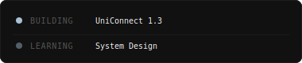

<div align="center">

# Rafsan Riasat

CS Student &nbsp;·&nbsp; Android & Frontend Developer &nbsp;·&nbsp; AI/ML Enthusiast

&nbsp;

[](https://narukami00.github.io/portfolio_react/)&nbsp;&nbsp;[](https://www.linkedin.com/in/rafsan-riasat-215689370)&nbsp;&nbsp;[](mailto:riasat1011@gmail.com)

</div>

&nbsp;

```
Languages    C · C++ · Python · Java · JavaScript · Dart · TypeScript
Mobile       Flutter · Android Studio
Web          React · Node.js · HTML · CSS
ML           PyTorch · Reinforcement Learning · Stable Baselines3
Tools        Firebase · PostgreSQL · Git
```

&nbsp;

<div align="center">
  
</div>

&nbsp;

<div align="center">
  
</div>

&nbsp;

<div align="center">
  <sub>
    <a href="https://narukami00.github.io/portfolio_react/">narukami00</a>
    &nbsp;·&nbsp;
    Chittagong, Bangladesh
  </sub>
</div>
